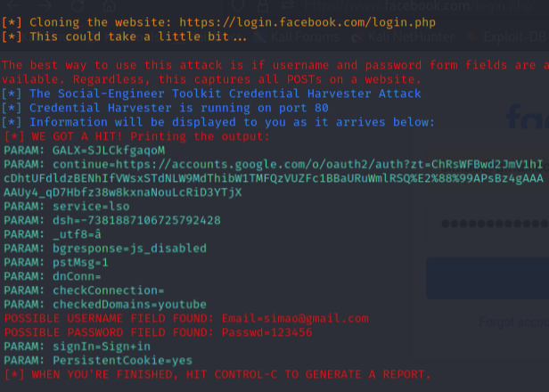

# <h1>Desafio-Phishing</h1>

### <h2>Ferramentas</h2>
- Kali linux 
- Setoolkit 

### <h2>Passos a seguir</h2>
- Raiz de acesso: sudo su 
- Iniciando o setoolkit: setoolkit 
- Tipo de ataque: Social-Engineering Attacks 
- Vetor de ataque: Web Site Attack Vectors 
- Método de ataque: Credential Harvester Attack Method 
- Método de ataque: Site Cloner 
- Obtendo o endereço da máquina: ifconfig 
- URL para clone: http://www.facebook.com 

<h2>Resultados</h2>

